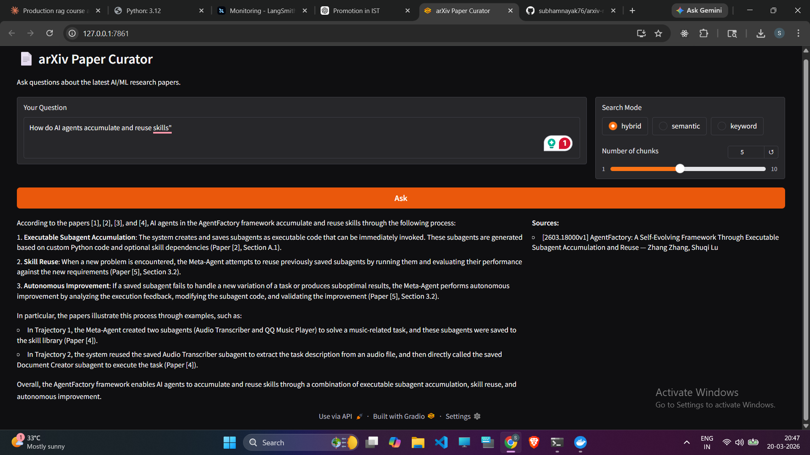

# arXiv Paper Curator — Production RAG System



A production-grade Retrieval-Augmented Generation (RAG) system that automatically ingests arXiv research papers daily and answers questions about them using hybrid search and a Groq LLM.


---

## Architecture

```
arXiv API → Airflow DAG → PDF Extraction → PostgreSQL
                                              ↓
                                    Jina AI Embeddings
                                              ↓
                                           Qdrant
                                              ↓
User → Gradio UI → FastAPI → Hybrid Search → Groq LLM → Answer
                                    ↑
                               Redis Cache
                                    ↑
                             LangSmith Tracing
```

---

## Stack

| Component | Technology |
|---|---|
| **Orchestration** | Apache Airflow |
| **Vector Store** | Qdrant |
| **Metadata DB** | PostgreSQL |
| **Embeddings** | Jina AI (`jina-embeddings-v3`) |
| **LLM** | Groq (`llama-3.1-8b-instant`) |
| **Retrieval** | LangChain (Hybrid: BM25 + Semantic) |
| **Caching** | Redis |
| **Observability** | LangSmith |
| **API** | FastAPI |
| **UI** | Gradio |

---

## Features

- **Daily paper ingestion** — Airflow DAG fetches latest arXiv papers (cs.AI, cs.LG, cs.CL) every weekday
- **PDF text extraction** — PyMuPDF extracts full text from downloaded PDFs
- **Hybrid search** — Combines BM25 keyword search with semantic vector search for best results
- **RAG pipeline** — Retrieves relevant chunks and passes them to Groq LLM for answer generation
- **Redis caching** — Identical queries return cached answers in ~10ms instead of 1-2 seconds
- **LangSmith tracing** — Every LLM call and retrieval is traced for monitoring
- **Gradio UI** — Clean chat interface for asking questions

---

## Project Structure

```
arxiv-rag/
├── src/
│   ├── routers/              # FastAPI endpoints (health, search, ask, hybrid-search)
│   ├── services/
│   │   ├── arxiv/            # arXiv API client + PDF parser
│   │   ├── embeddings/       # Jina AI embedding service
│   │   ├── groq/             # Groq LLM client
│   │   ├── indexing/         # Chunker + indexing pipeline
│   │   ├── observability/    # LangSmith tracing
│   │   ├── cache/            # Redis cache service
│   │   ├── qdrant/           # Qdrant vector store client
│   │   ├── rag/              # RAG pipeline orchestrator
│   │   └── search/           # BM25 keyword search
│   ├── models/               # SQLAlchemy DB models
│   ├── schemas/              # Pydantic schemas
│   ├── config.py             # Environment config
│   ├── database.py           # DB connection
│   └── main.py               # FastAPI app entry point
├── airflow/
│   ├── dags/
│   │   └── arxiv_ingestion.py  # Daily ingestion DAG
│   └── Dockerfile
├── compose.yml               # Docker Compose stack
├── Dockerfile                # FastAPI app image
├── gradio_launcher.py        # Gradio UI
├── pyproject.toml
└── .env.example
```

---

## Quick Start

### Prerequisites

- Docker Desktop with WSL2 (Windows) or Docker (Linux/Mac)
- Python 3.12+
- API keys: [Groq](https://console.groq.com) (free), [Jina AI](https://jina.ai) (free), [LangSmith](https://smith.langchain.com) (free)

### 1. Clone and configure

```bash
git clone https://github.com/subhamnayak76/arxiv-rag.git
cd arxiv-rag
cp .env.example .env
```

Fill in your API keys in `.env`:

```env
GROQ_API_KEY=gsk_...
JINA_API_KEY=jina_...
LANGCHAIN_API_KEY=ls__...
```

Generate Airflow Fernet key:

```bash
python -c "from cryptography.fernet import Fernet; print(Fernet.generate_key().decode())"
```

Paste into `.env` as `AIRFLOW_FERNET_KEY`.

### 2. Start infrastructure

```bash
docker compose up -d postgres qdrant redis langfuse
```

### 3. Initialize and start Airflow

```bash
docker compose up -d airflow-init
# wait ~2 minutes
docker compose up -d airflow-webserver airflow-scheduler
```

### 4. Start FastAPI app

```bash
docker compose up -d app
```

### 5. Ingest papers

- Open Airflow at **http://localhost:8080** (admin/admin)
- Trigger the `arxiv_paper_ingestion` DAG
- Wait for it to complete

### 6. Index papers into Qdrant

```bash
curl -X POST http://localhost:8000/api/v1/index
```

### 7. Launch Gradio UI

```bash
pip install gradio httpx
python gradio_launcher.py
```

Open **http://localhost:7861** and start asking questions!

---

## API Endpoints

| Endpoint | Method | Description |
|---|---|---|
| `/health` | GET | Health check |
| `/api/v1/search` | GET | BM25 keyword search |
| `/api/v1/hybrid-search` | GET | Hybrid search (BM25 + semantic) |
| `/api/v1/ask` | POST | Ask a question (RAG) |
| `/api/v1/index` | POST | Index unembedded papers into Qdrant |

Full API docs at **http://localhost:8000/docs**

---

## Service URLs

| Service | URL |
|---|---|
| Gradio UI | http://localhost:7861 |
| API Docs | http://localhost:8000/docs |
| Airflow | http://localhost:8080 |
| Langfuse | http://localhost:3000 |
| Qdrant Dashboard | http://localhost:6333/dashboard |

---

## Environment Variables

See `.env.example` for all required variables. Key ones:

| Variable | Description |
|---|---|
| `GROQ_API_KEY` | Groq API key for LLM |
| `JINA_API_KEY` | Jina AI key for embeddings |
| `LANGCHAIN_API_KEY` | LangSmith key for tracing |
| `ARXIV_CATEGORIES` | Comma-separated arXiv categories |
| `ARXIV_MAX_RESULTS` | Papers per category per sync |

---

## License

MIT
